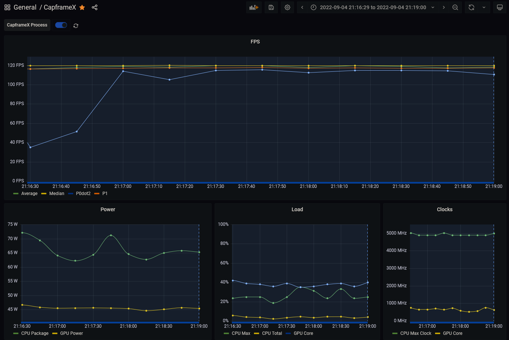

# CapFrameX exporter

[Prometheus](https://prometheus.io/) exporter for [CapFrameX](https://www.capframex.com/)

# Example




# Setup

Add this to your `scrape_config` in Prometheus:

```yaml
- job_name: capframex_exporter
  static_configs:
    - targets: ["localhost:9032"] # or wherever your host the exporter
```

Run this process:

```sh
$ capframex-exporter -c host-running-capframex:1337
```

Use `--help` to see more options, it defaults to monitoring `Average`, `P1`, `P0dot2` FPS metrics.

# Features

It exports the active process being captured by CX, FPS stats (customizable) and HW sensor data (customizable in CX, tick "Use for logging" on the sensors you want to see).

```
# HELP capframex_active_process Process currently being monitored by CapFrameX.
# TYPE capframex_active_process gauge
capframex_active_process{name="Vampire Survivors"} 1
# HELP capframex_fps Performance metric tracked by CapFrameX.
# TYPE capframex_fps gauge
capframex_fps {name="Median"} 119.8
capframex_fps {name="P1"} 3.95
capframex_fps {name="P0dot2"} 3.95
capframex_fps {name="Average"} 37.53
# HELP capframex_sensor Hardware sensor tracked by CapFrameX.
# TYPE capframex_sensor gauge
capframex_sensor {name="CPU Max", type="Load"} 43.75
capframex_sensor {name="GPU Core", type="Temperature"} 41
capframex_sensor {name="CPU Package", type="Power"} 89.633194
capframex_sensor {name="CPU Max Clock", type="Clock"} 4900
capframex_sensor {name="CPU Package", type="Temperature"} 63.875
capframex_sensor {name="GPU Memory Dedicated", type="Data"} 3.73379135
capframex_sensor {name="GPU Power Limit", type="Factor"} 0
capframex_sensor {name="GPU Power", type="Power"} 37.4660034
capframex_sensor {name="CPU Total", type="Load"} 12.7080736
capframex_sensor {name="GPU Core", type="Clock"} 210.000015
capframex_sensor {name="GPU Core", type="Load"} 22
capframex_sensor {name="Used Memory Game", type="Data"} 0.0299110413
```
